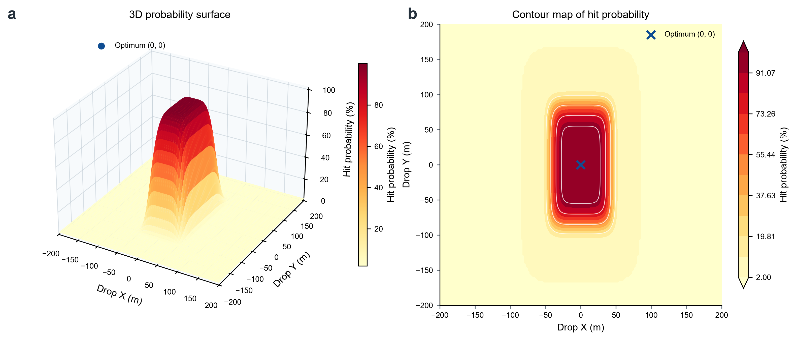
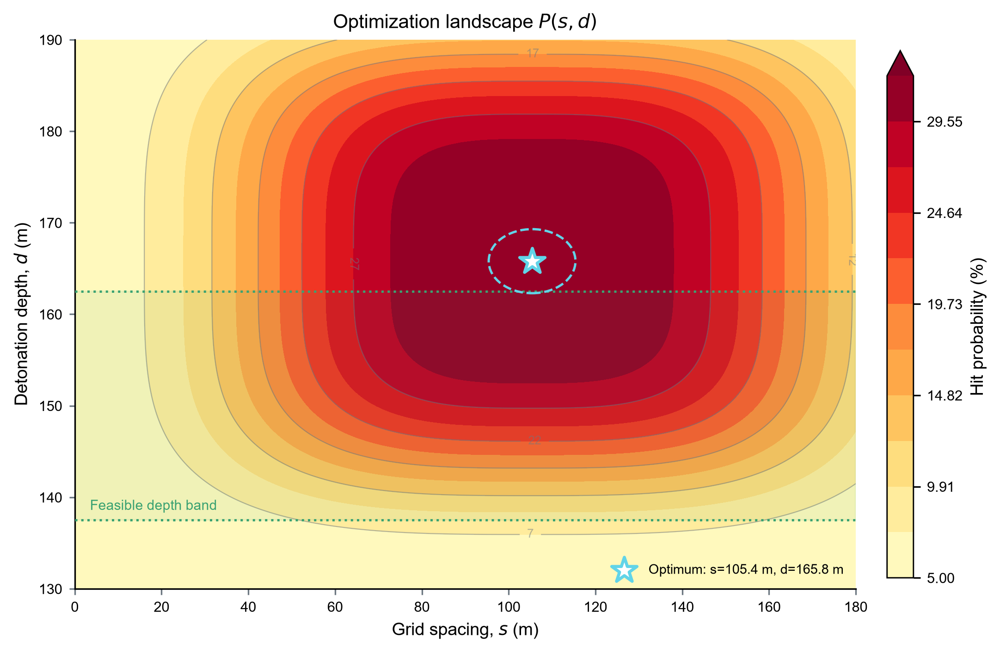
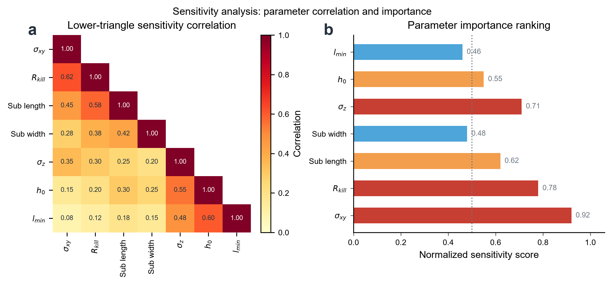
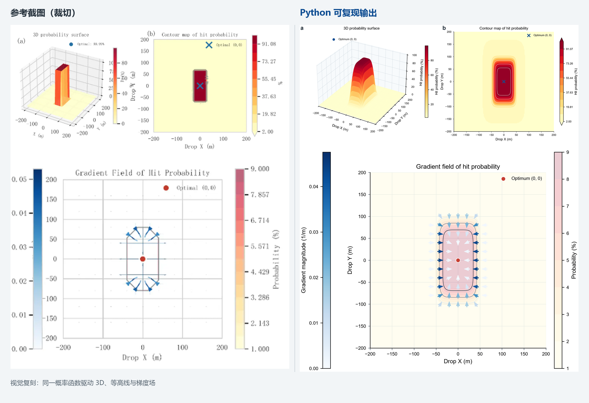

# 数学建模与科研论文绘图库 Skill

面向 **CUMCM、MCM/ICM 等数学建模竞赛**以及**科研论文配图**的开源 Codex Skill。它提供可检索的图型图库、视觉复刻参考和可运行模板，帮助智能体完成图型选择、布局设计、按真实数据重画及论文图片润色。

> Modeling & Research Figure Gallery for Codex — figure selection, visual reconstruction and polishing for mathematical-modeling contests and research papers.

本项目复用的是图表的视觉语法与证据组织方式，不从截图猜测隐藏数据，也不把模拟数据冒充真实实验或竞赛结果。

## 图库预览

以下图片均已收录在 Skill 中。预览中的数值为演示或模拟数据，实际使用时应替换为用户自己的计算结果。

| 三维概率曲面与等高线 | 二维参数优化景观 |
| --- | --- |
| [](assets/previews/modeling-templates/math-repro-probability-surface-contour.png) | [](assets/previews/modeling-templates/math-repro-optimization-landscape.png) |

| 参数相关性与重要性 | 散点与气泡图型图谱 |
| --- | --- |
| [](assets/previews/modeling-templates/math-repro-correlation-importance.png) | [](assets/previews/chart-atlas/research-atlas-scatter.png) |

| 高水平科研多面板布局 | 参考截图与 Python 复现对比 |
| --- | --- |
| [](assets/previews/multi-panel/research-blueprint-material.png) | [](assets/qa-comparisons/compare-01-probability-field.png) |

完整的离线可视化图库请下载仓库后打开 [`index.html`](index.html)。

## 收录内容

| 类别 | 数量 | 用途 |
| --- | ---: | --- |
| 正式图库 | 35 张 | 直接检索、选图和视觉重构 |
| 可运行 Python 模板 | 16 个 | 生成 300 dpi PNG 与文字可编辑 SVG |
| 数学建模示例 | 4 张 | 轨迹、机制、灵敏度和诊断布局参考 |
| 图型图谱 | 10 张 | 柱图、折线、热图、散点、分布、雷达、森林图、面积图、图像板和网络图 |
| 科研多面板蓝图 | 5 张 | 材料、成像、临床、单细胞和验证类版式 |
| 原始参考截图 | 11 张 | 保存视觉来源与复刻依据 |
| QA 对比板 | 9 张 | 对照参考截图与复现结果 |

仓库合计包含 **55 张不重复 PNG、20 张 SVG、16 个确定性 Python 模板**，覆盖 **40 余种图型或组合方式**。其中 16 张代码生成 SVG 保留可编辑文字；35 张正式图可通过 [`references/catalog.json`](references/catalog.json) 被程序检索。

## 适合解决什么问题

- 为国赛、美赛论文选择合适的结果图、敏感性图、验证图或优化图。
- 根据一张参考图拆解其布局、颜色、编码、标注和证据层级。
- 用用户提供的真实数据重画，而不是从像素反推未知数据。
- 将普通 Matplotlib 图润色为更清晰、统一、适合论文排版的版本。
- 为科研论文选择单图、组合图或高信息密度多面板布局。
- 输出可编辑 SVG 和 300 dpi PNG，便于继续排版与修改。

## 安装

最简单的方法是在 Codex 中直接说：

```text
请从 https://github.com/zwl827125-glitch/modeling-research-figure-skill 安装这个 Skill。
```

也可以手动克隆到 Codex 的 skills 目录：

```powershell
git clone https://github.com/zwl827125-glitch/modeling-research-figure-skill.git "$env:USERPROFILE\.codex\skills\modeling-research-figure-skill"
```

macOS/Linux：

```bash
git clone https://github.com/zwl827125-glitch/modeling-research-figure-skill.git "${CODEX_HOME:-$HOME/.codex}/skills/modeling-research-figure-skill"
```

## 使用示例

```text
$modeling-research-figure-skill 根据我的二维优化结果，选择一个能同时展示可行域和最优解的图版。
```

```text
$modeling-research-figure-skill 按 modeling-bootstrap 的视觉结构重画这组重采样结果，输出 SVG 和 300 dpi PNG。
```

```text
$modeling-research-figure-skill 为回归诊断、稳健性分析和最终结论设计一张多面板论文图。
```

## 检索图库

```powershell
python scripts/find_figure.py "灵敏度"
python scripts/find_figure.py "优化"
python scripts/find_figure.py "imaging" --status static-reference
```

## 可选：重新生成代码模板

```powershell
python -m pip install -r scripts/requirements.txt
python scripts/reproduce_all.py
```

16 个模板使用固定随机种子、确定性演示数据和数值断言。三维参数曲线模板与可见公式严格一致；其余模板复现图表结构和分析逻辑，不声称恢复不可见的原始数组。

## 项目结构

```text
modeling-research-figure-skill/
├── SKILL.md                    # Skill 入口与工作规则
├── agents/openai.yaml          # Codex 界面元数据
├── index.html                  # 完整离线图库
├── references/                # 图库目录、选图指南、来源与诚信规则
├── assets/
│   ├── previews/              # 35 张正式图
│   ├── vectors/               # 20 张 SVG
│   ├── source-references/      # 11 张原始参考截图
│   └── qa-comparisons/         # 9 张复现对比板
└── scripts/                   # 检索、复现与发布校验脚本
```

## 科研诚信与使用边界

- 静态参考图是布局和视觉编码蓝图，不是隐藏科学数值的来源。
- 不得把合成演示数据描述为真实实验、观测或竞赛结果。
- 参加正在进行的比赛时，应遵守当届 AI 使用、披露和提交规则。
- 本社区项目与 Nature Portfolio、COMAP、CUMCM 及任何赛事组织方均无隶属关系。

## 许可证与来源

项目以 [Apache License 2.0](LICENSE) 开源。第三方来源、固定版本与资源哈希记录见 [`NOTICE.md`](NOTICE.md) 和 [`references/upstream-assets.json`](references/upstream-assets.json)。
